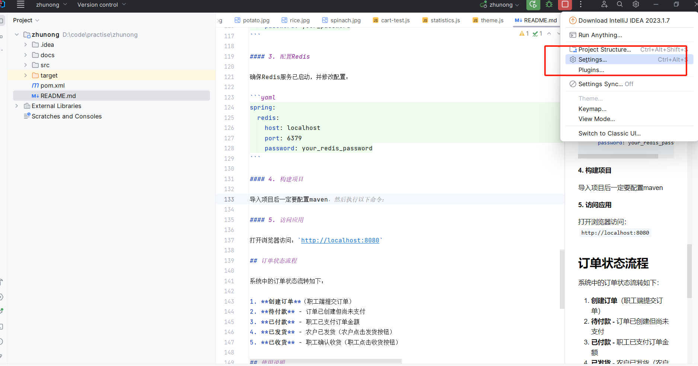
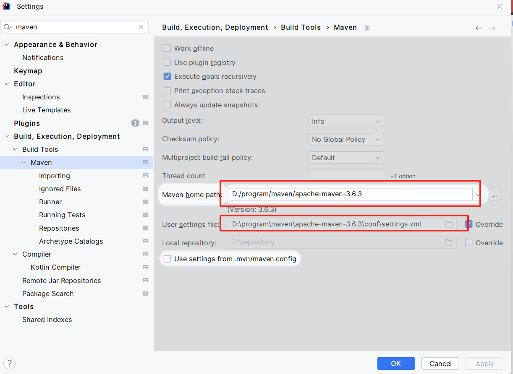
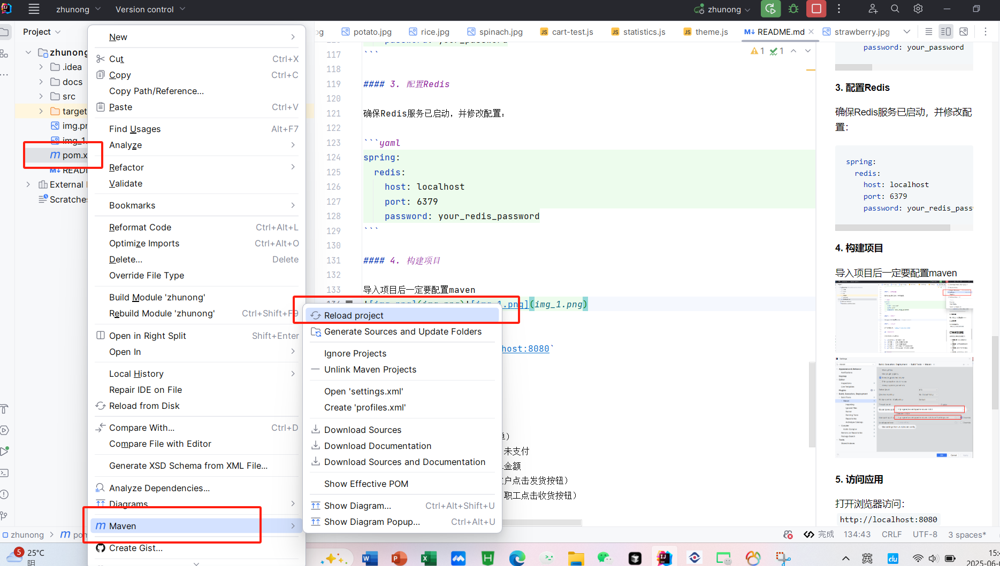

# 暖心助农选品平台

暖心助农选品平台是一个专为农户和企事业单位职工设计的农产品电商平台，旨在促进农产品销售，助力乡村振兴。平台连接农户和职工，提供直接的农产品交易渠道，减少中间环节，实现农户增收和职工享受优质农产品的双赢局面。

## 项目功能特性

### 用户角色

- **职工用户**：浏览商品、加入购物车、下单购买、订单管理
- **农户用户**：管理商品、处理订单（发货等）
- **管理员**：用户管理、商品审核、订单管理、统计分析

### 核心功能

1. **商品浏览与筛选**
   - 商品分类展示
   - 价格区间筛选
   - 商品排序（价格升降序、最新上架、销量优先）
   - 关键词搜索

2. **购物车管理**
   - 添加/删除商品
   - 修改数量
   - 清空购物车

3. **订单系统**
   - 订单创建与支付
   - 订单状态流转（待付款→已付款→已发货→已收货）
   - 订单筛选与搜索

4. **用户账户**
   - 账户余额管理
   - 个人信息维护
   - 收货地址管理

## 技术栈

### 后端

- **核心框架**：Spring Boot 2.7.5
- **安全框架**：Spring Security
- **ORM框架**：MyBatis Plus 3.5.2
- **数据库**：MySQL
- **缓存**：Redis
- **模板引擎**：Thymeleaf

### 前端

- **UI框架**：Bootstrap 5
- **图标库**：Bootstrap Icons
- **JS库**：原生JavaScript + axios
- **交互体验**：CSS3 动画和过渡效果

## 系统架构

```
暖心助农选品平台
├── 表示层（Presentation Layer）
│   ├── Thymeleaf 模板
│   └── Bootstrap 5 UI
├── 控制层（Controller Layer）
│   ├── UserController - 用户管理
│   ├── ProductController - 商品管理
│   ├── CartController - 购物车管理
│   ├── OrderController - 订单管理
│   └── AccountController - 账户管理
├── 服务层（Service Layer）
│   ├── UserService - 用户服务
│   ├── ProductService - 商品服务
│   ├── CartService - 购物车服务
│   ├── OrderService - 订单服务
│   └── AccountService - 账户服务
└── 数据访问层（DAO Layer）
    ├── MyBatis Plus Mappers
    └── MySQL 数据库
```

## 安装部署

### 环境要求

- JDK 1.8+
- Maven 3.6+
- MySQL 5.7+
- Redis 6.0+

### 部署步骤


#### 1. 配置数据库
创建同名数据库zhunong
zhunong\src\main\resources\db\zhunong.sql导入本地数据库


#### 2. 配置文件修改 `src/main/resources/application.yml` 中的数据库配置：

```yaml
   spring:
  datasource:
    url: jdbc:mysql://localhost:3306/zhunong?useUnicode=true&characterEncoding=utf-8&serverTimezone=Asia/Shanghai
    username: your_username
    password: your_password
```

#### 3. 配置Redis

确保Redis服务已启动，并修改配置：

```yaml
spring:
  redis:
    host: localhost
    port: 6379
    password: your_redis_password
```

#### 4. 构建项目

导入项目后一定要配置maven,教程如下：

#### 5. 访问应用

打开浏览器访问：`http://localhost:8088`

## 订单状态流程

系统中的订单状态流转如下：

1. **创建订单**（职工端提交订单）
2. **待付款** - 订单已创建但尚未支付
3. **已付款** - 职工已支付订单金额
4. **已发货** - 农户已发货（农户点击发货按钮）
5. **已收货** - 职工确认收货（职工点击收货按钮）

## 使用说明

### 职工用户

1. 登录系统（默认账号：employee1，密码：employee123）
2. 浏览商品列表，可通过分类、价格区间筛选商品
3. 将商品加入购物车
4. 提交订单并支付
5. 在"我的订单"页面查看和管理订单

### 农户用户

1. 登录系统（默认账号：farmer1，密码：farmer123）
2. 在"商品管理"页面添加、编辑、上下架商品
3. 在"订单管理"页面处理订单，确认发货

### 管理员

1. 登录系统（默认账号：admin，密码：admin123）
2. 在"用户管理"页面管理用户
3. 在"商品审核"页面审核商品
4. 在"订单管理"页面查看所有订单
5. 在"统计分析"页面查看销售数据

